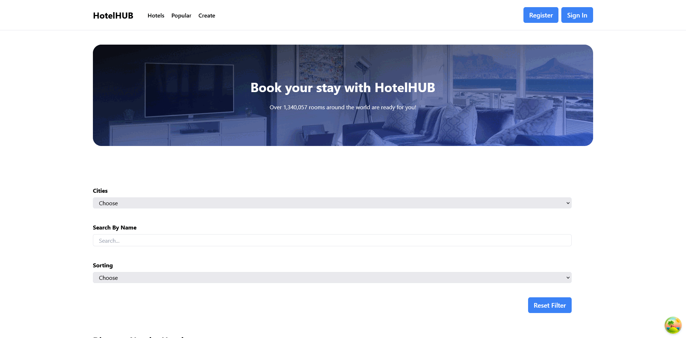

# Hotel in React Vite

## Description

A hotel booking application built with React Vite and TypeScript. It allows users to browse, search, and book hotels, providing a smooth and interactive experience.

## Features

- Search for hotels based on location and dates
- Filter hotels by amenities, price, and ratings
- View detailed information about each hotel
- Book hotels and receive instant confirmation
- User authentication and profile management

## Libraries

- **typescript**:Adds static typing to JavaScript, improving code quality and development experience.
- **react-router-dom**:Manages in-app routing, enabling navigation between different pages.
- **tailwind**:Utility-first CSS framework for styling the application with ease.
- **framer-motion**:Adds animations and transitions to enhance the user interface.
- **typewriter-effect**:Creates a typewriter animation for displaying dynamic text content.
- **@tanstack/react-query**:Handles server-state management and data fetching.
- **@tanstack/react-query-devtools**:Devtools for debugging and inspecting queries.
- **axios**:Simplifies HTTP requests for fetching data from APIs.
- **react-toastify**:Displays notifications for success, errors, or info.
- **react-icons**:Provides a set of popular icons for use throughout the app.
- **formik**:Simplifies form handling, validation, and submission.

## Elements

- [Button](https://uiverse.io/elijahgummer/thin-rabbit-53) :A visually appealing button element used in the application.
- [Loader](https://uiverse.io/devAaus/funny-catfish-94) :A custom loader animation for indicating loading states.

## Preview



## Deployment

The project is deployed and can be accessed [](). For the project to run smoothly, please follow the installation steps below to set it up locally.The project may behave differently across different browsers.

## Installation

To run the project locally, follow these steps:

1. Clone the repository:

```bash
git clone https://github.com/KamilErdogmus/HotelHUB.git
```

2. Navigate to the backend directory and install dependencies:

```bash
cd your-repository
```

```bash
cd backend
```

```bash
npm install
```

3. Start the backend server

```bash
npm run server
```

4. Navigate to the frontend directory and install dependencies:

```bash
cd ../frontend
```

```bash
npm install
```

5. Start the development server:

```bash
npm  npm run dev
```

6. Open your web browser and visit http://localhost:5173 to view the application.
